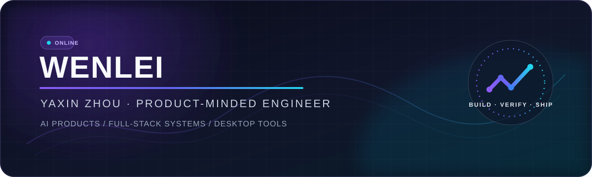

<div align="center">
  
</div>

<div align="center">
  <a href="https://github.com/YaXin-Zhou?tab=repositories"></a>
  <a href="mailto:3518804375z@gmail.com"></a>
</div>

<br />

## Hello, I'm WenLei 👋

I am an independent product engineer who turns AI ideas into usable, testable and maintainable products — from AI-native workflows and data-intensive backends to polished web and desktop experiences.

我是一名偏产品思维的独立开发者，专注于把 **AI 能力落地为可运行、可验证、可交付的产品**。我关注 AI 应用、可靠系统、自动化工作流，以及从界面到部署的完整交付。

```text
CURRENT FOCUS  AI products · Workflow automation · Full-stack systems · Desktop tools
ENGINEERING    Product thinking · Reliable systems · Safe automation · Evidence-led shipping
```

## Featured project

### [TradePilot](https://github.com/YaXin-Zhou/TradePilot)

An AI-assisted cryptocurrency quantitative trading platform combining backtesting, live market data, strategy execution, layered risk control and observability.

**Why it represents my work:** it connects product workflow, AI integration, backend services, data, risk boundaries and operational visibility in one system.

`Python` · `FastAPI` · `Next.js` · `PostgreSQL` · `Docker`

## Selected work

| Project | What it does | Core stack |
|:--|:--|:--|
| **[sensory-lab](https://github.com/YaXin-Zhou/sensory-lab)** | AI research platform covering survey generation, quota control, statistical analysis, NLP coding and report delivery. | FastAPI · React · Vue · pgvector · Qwen |
| **[liuyao-ai](https://github.com/YaXin-Zhou/liuyao-ai)** | A desktop-ready I Ching charting app with streaming DeepSeek interpretation and local history. | Python · Streamlit · DeepSeek · PyInstaller |
| **[Delta Force Account Inspector](https://github.com/YaXin-Zhou/Delta-Force-Account-Inspector)** | A bilingual Windows desktop app for Steam profile, ban-status, inventory and game-account inspection. | Electron · React · TypeScript · Vite |

<div align="center">
  <sub>More experiments live in <a href="https://github.com/YaXin-Zhou?tab=repositories">my repositories →</a></sub>
</div>

## Engineering map

<div align="center">

**Product & application**


**Backend & intelligence**


**Delivery & infrastructure**


</div>

## How I build

- **Start from the real workflow.** Define the user journey and acceptance result before expanding the feature list.
- **Make AI controllable.** Add validation, fallbacks, review gates and observability around model output.
- **Ship the whole path.** Treat interface, backend, data, deployment and recovery as one product system.
- **Prefer evidence.** Tests, visible UI results and reproducible checks matter more than optimistic claims.

## What you can expect from my projects

- A clear user workflow before the feature list grows.
- Validation, fallbacks and review boundaries around AI-generated output.
- Reproducible setup instructions, visible results and honest capability boundaries.
- A practical path from prototype to a maintainable application.

## Contribution trail

<div align="center">
  <picture>
    <source media="(prefers-color-scheme: dark)" srcset="https://raw.githubusercontent.com/YaXin-Zhou/YaXin-Zhou/output/github-contribution-grid-snake-dark.svg" />
    <source media="(prefers-color-scheme: light)" srcset="https://raw.githubusercontent.com/YaXin-Zhou/YaXin-Zhou/output/github-contribution-grid-snake.svg" />
    
  </picture>
</div>

## Connect

I am open to conversations about AI products, full-stack engineering, desktop tools and practical automation.

<div align="center">
  <a href="https://github.com/YaXin-Zhou"></a>
  <a href="mailto:3518804375z@gmail.com"></a>
</div>

<br />

<div align="center">
  <sub>Build with clarity. Ship with evidence. Keep learning.</sub>
</div>
